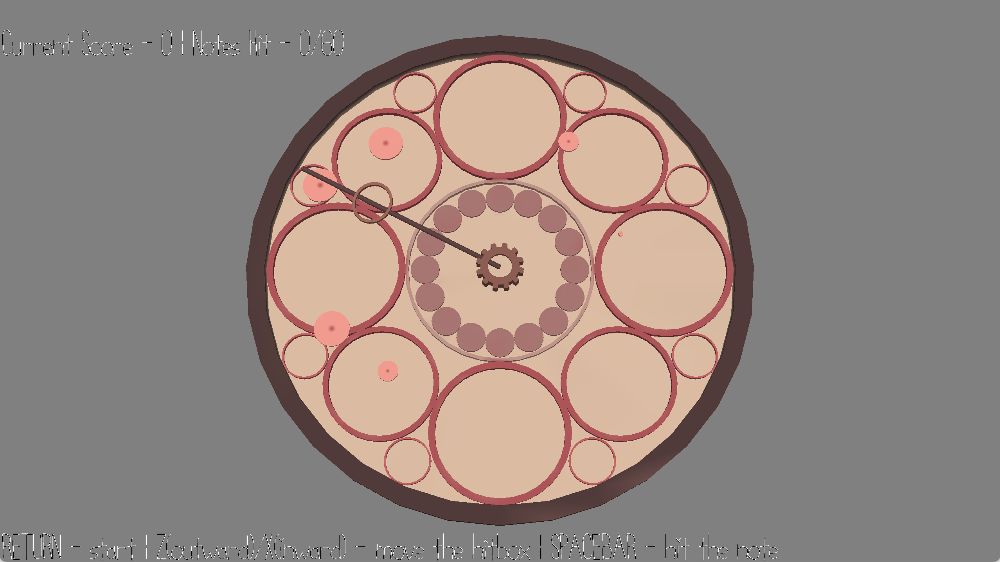

# Cliclock

(shoutout to [TheNumbat](https://thenumb.at/) for naming idea)

**Author**: Joanna Y

**Design**: Rhythm game on a clock where you aim along the clock arm and hit the note with your keyboard.

**Screen Shot**:

**How To Play**:

- RETURN to start playing
- Z(outward)/X(inward) to move the hitbox along the clock arm
- SPACEBAR to hit the note when the arm rotation and hitbox position matches the note

This game was built with [NEST](NEST.md).
